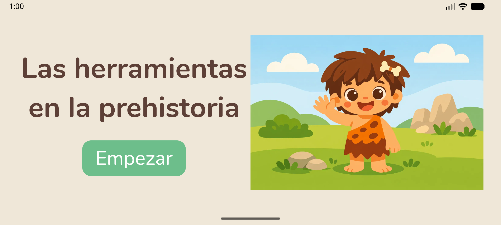
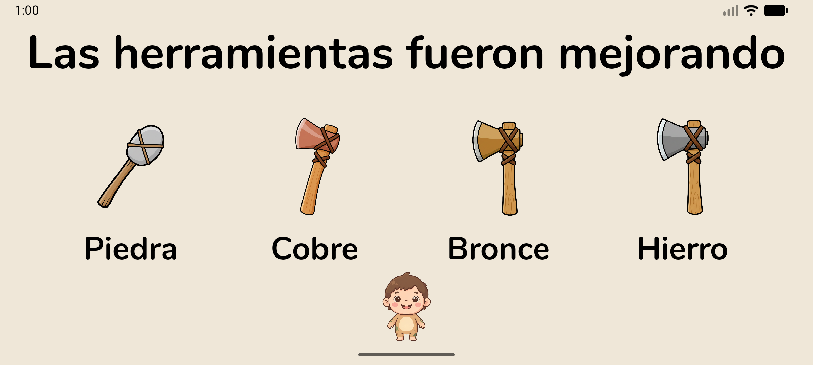
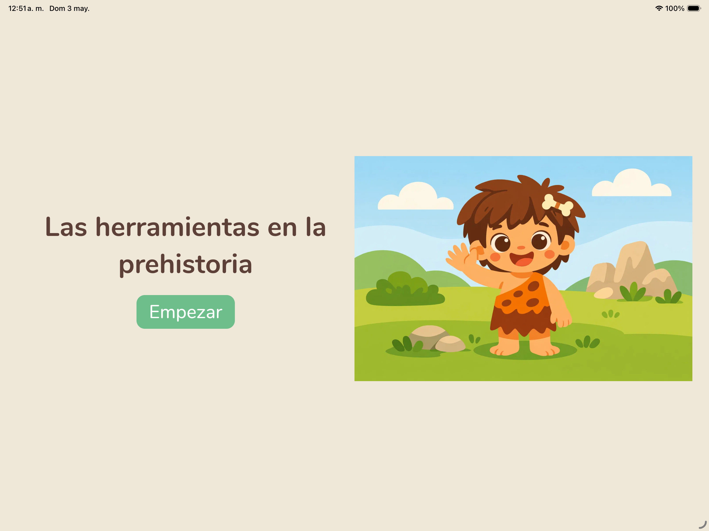
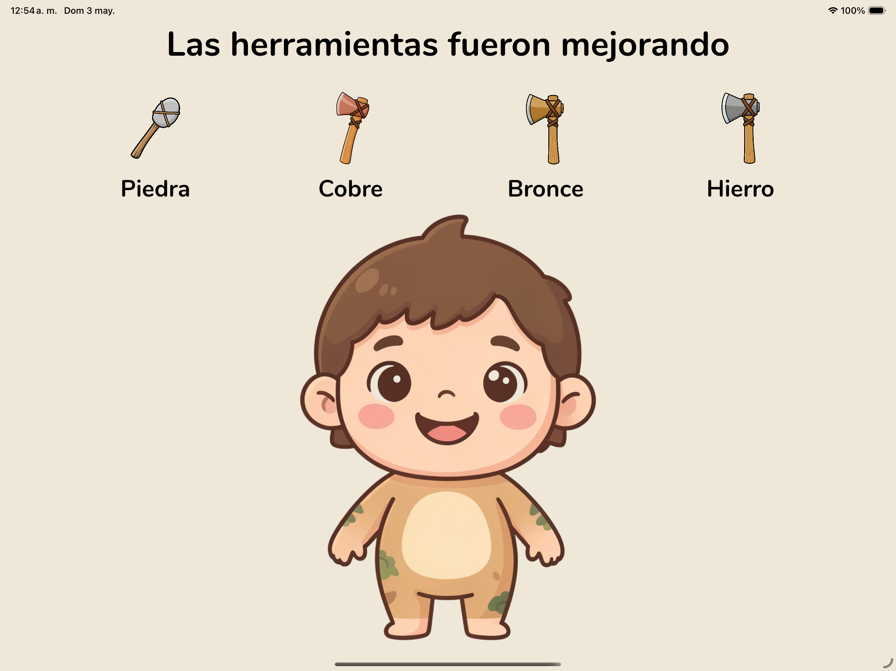
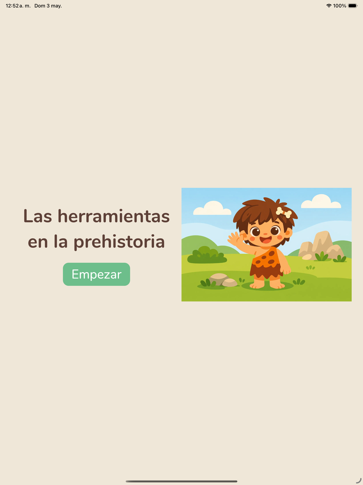
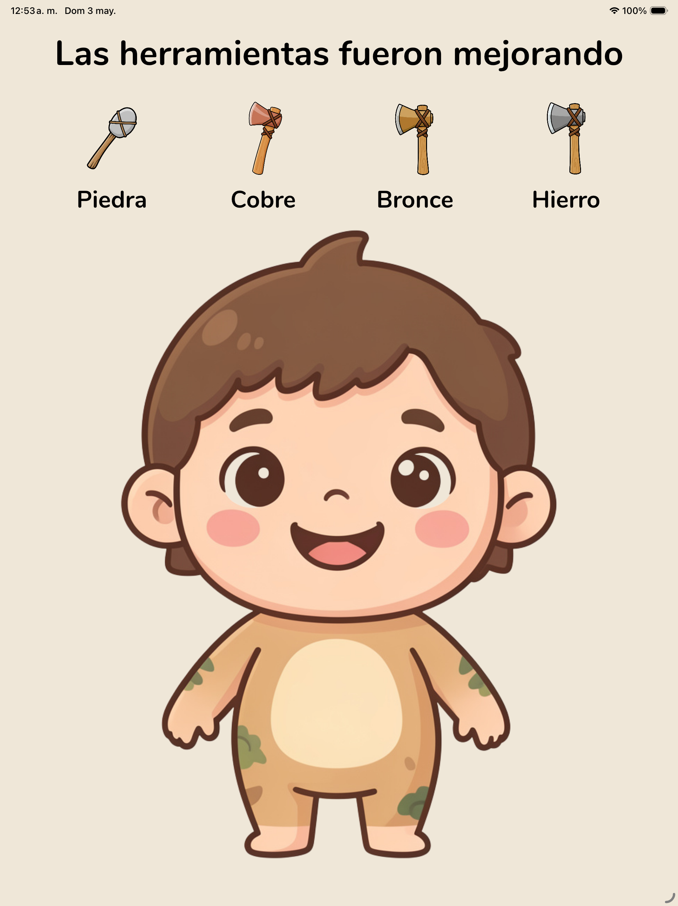

# 🏛️ Metal Tools - Prehistory

Una aplicación educativa multiplataforma que explora la evolución de las herramientas a través de las edades de la Prehistoria: Piedra, Cobre, Bronce e Hierro.

Desarrollada con **Kotlin Multiplatform** y **Compose Multiplatform**, disponible para **Android** e **iOS**.

---

## 🎓 Origen del Proyecto

> **💖 Este proyecto nació como una tarea escolar de mi hija de 5 años** en el colegio, donde tenía que aprender sobre la Prehistoria y la evolución de las herramientas. 
> 
> Lo que comenzó como una simple presentación se transformó en esta aplicación interactiva educativa. Una forma especial de combinar la enseñanza con la tecnología para hacer el aprendizaje más divertido y memorable. 🚀

---

## 📱 Características

- **Interactivo y Educativo**: Aprende sobre la evolución de las herramientas en la prehistoria
- **Multiplataforma**: Compatible con Android e iOS
- **Interfaz Moderna**: Diseño limpio con Compose Multiplatform
- **Audiovisuales**: Incluye audio educativo para cada era
- **Responsive**: Optimizado para teléfonos y tablets
- **Paisaje**: Interfaz adaptada para modo horizontal

---

## ✨ ¿Por Qué Este Proyecto?

La Prehistoria es un tema fascinante para aprender, especialmente para los niños. Este proyecto demuestra cómo:

- 📚 **La educación puede ser divertida**: Combina juego e interacción
- 👧 **Inspire a los más pequeños**: Si una tarea de 5 años se convirtió en esto, ¡imagina lo que puedes crear tú!
- 💡 **La tecnología sirve al aprendizaje**: No es solo código, es educación
- 🌍 **Multiplataforma para todos**: Accesible en cualquier dispositivo

---

## 🎮 Pantallas

### Android (Teléfono)

**Inicio**
<div align="center">
  
</div>

**Pantalla Final de Eras**
<div align="center">
  
</div>

### iOS (Tablet - Horizontal)

**Inicio**
<div align="center">
  
</div>

**Pantalla Final de Eras**
<div align="center">
  
</div>

### iOS (Tablet - Vertical)

**Inicio**
<div align="center">
  
</div>

**Pantalla Final de Eras**
<div align="center">
  
</div>

---

## 🏗️ Arquitectura

### Estructura del Proyecto

```
MetalToolsPreHistory/
├── composeApp/                          # Módulo principal compartido
│   ├── src/
│   │   ├── commonMain/                  # Código compartido (iOS + Android)
│   │   │   ├── kotlin/dev/yahyrparedes/metaltools/
│   │   │   │   ├── App.kt               # Punto de entrada
│   │   │   │   ├── Platform.kt          # Interfaz multiplataforma
│   │   │   │   ├── ui/                  # Componentes de UI
│   │   │   │   ├── data/                # Datos (eras, herramientas)
│   │   │   │   ├── theme/               # Temas y estilos
│   │   │   │   ├── audio/               # Jugador de audio (expect)
│   │   │   │   └── platform/            # Recursos compartidos
│   │   │   └── composeResources/        # Recursos (imágenes, audio)
│   │   ├── androidMain/                 # Código específico Android
│   │   │   ├── kotlin/dev/yahyrparedes/metaltools/
│   │   │   │   ├── MainActivity.kt
│   │   │   │   ├── MainApplication.kt
│   │   │   │   ├── audio/AudioPlayer.android.kt
│   │   │   │   └── ...
│   │   │   └── res/                     # Recursos Android (audio, etc)
│   │   └── iosMain/                     # Código específico iOS
│   │       ├── kotlin/dev/yahyrparedes/metaltools/
│   │       │   ├── MainViewController.kt
│   │       │   ├── audio/AudioPlayer.ios.kt
│   │       │   └── ...
│   │       └── ...
│   └── build.gradle.kts                 # Configuración de build
├── iosApp/                              # Proyecto nativo iOS
│   ├── iosApp/
│   │   ├── Resources/                   # Recursos iOS (audio)
│   │   ├── Assets.xcassets/
│   │   └── ...
│   └── iosApp.xcodeproj/
├── gradle/                              # Gradle wrapper
├── build.gradle.kts                     # Build configuration
├── settings.gradle.kts
└── README.md                            # Este archivo
```

### Tecnologías

- **Kotlin Multiplatform**: Compartir código entre plataformas
- **Jetpack Compose**: UI declarativa moderna
- **Compose Multiplatform**: Mismo código de UI para iOS y Android
- **Gradle Kotlin DSL**: Build configuration type-safe

---

## 🎓 Eras Incluidas

### 1. 🪨 Edad de Piedra
Primera herramienta: una piedra tallada

### 2. 🔶 Edad del Cobre
Descubrimiento del metalurgia primaria

### 3. 🛡️ Edad del Bronce
Combinación de cobre y estaño

### 4. ⚔️ Edad del Hierro
La herramienta más resistente y duradera

Cada era incluye:
- ✨ Imagen visual de la herramienta
- 🎵 Audio educativo
- 📱 Información interactiva

---

## 🚀 Instalación y Setup

### Requisitos Previos

- **JDK 11+**: [Descargar](https://www.oracle.com/java/technologies/javase/jdk11-archive-downloads.html)
- **Xcode 14+**: Para compilar iOS (macOS)
- **Android Studio**: Opcional pero recomendado
- **CocoaPods**: Para iOS dependencies

```bash
# Instalar CocoaPods (si no lo tienes)
sudo gem install cocoapods
```

### 1️⃣ Clonar el Repositorio

```bash
git clone https://github.com/tuusuario/MetalToolsPreHistory.git
cd MetalToolsPreHistory
```

### 2️⃣ Configurar Recursos de Audio para iOS

Primero, asegúrate de que los archivos de audio estén en iOS:

```bash
./setup_ios_resources.sh
```

Luego, en Xcode:
1. Abre `iosApp/iosApp.xcodeproj`
2. Selecciona el target `iosApp`
3. Ve a `Build Phases → Copy Bundle Resources`
4. Arrastra la carpeta `Resources` si no aparece
5. Verifica que esté seleccionada para el target

### 3️⃣ Compilar y Ejecutar

#### Android

```bash
# Opción 1: Con Gradle
./gradlew composeApp:installDebug

# Opción 2: Con Android Studio
# File → Open → Selecciona la carpeta del proyecto
```

#### iOS

```bash
# Opción 1: Con Xcode
open iosApp/iosApp.xcodeproj

# Opción 2: Con Terminal
cd iosApp && xcodebuild -scheme iosApp -configuration Debug
```

---

## 🔧 Variables de Entorno y Configuración

### Package Name (Cambio de Identidad)

Si necesitas cambiar el package name de `dev.yahyrparedes.metaltools` a otro:

1. Actualiza `build.gradle.kts`:
```kotlin
android {
    namespace = "com.tu.nuevo.package"
    defaultConfig {
        applicationId = "com.tu.nuevo.package"
    }
}
```

2. Renombra las carpetas en `src/` respetando la estructura:
```
src/commonMain/kotlin/com/tu/nuevo/package/
src/androidMain/kotlin/com/tu/nuevo/package/
src/iosMain/kotlin/com/tu/nuevo/package/
```

3. Ejecuta un clean build:
```bash
./gradlew clean build
```

---

## 🎵 Audios Incluidos

El proyecto incluye 8 archivos de audio MP3:

| Audio | Descripción |
|-------|-------------|
| `inicio.mp3` | 🎤 Audio de bienvenida inicial |
| `final_.mp3` | 📢 Audio de conclusión |
| `audio_piedra.mp3` | 🪨 Sonido de la Edad de Piedra |
| `audio_cobre.mp3` | 🔶 Sonido de la Edad del Cobre |
| `audio_bronce.mp3` | 🛡️ Sonido de la Edad del Bronce |
| `audio_hierro.mp3` | ⚔️ Sonido de la Edad del Hierro |
| `initial.mp3` | 🎵 Audio alternativo de inicio |
| `success.mp3` | ✅ Sonido de interacción |

### 📍 Ubicación de Audios

- **Fuente común**: `composeApp/src/commonMain/composeResources/files/audio/`
- **Android**: Se accede vía resources
- **iOS**: `iosApp/iosApp/Resources/files/audio/`

### ➕ Agregar Nuevos Audios

1. Coloca el archivo `*.mp3` en `composeApp/src/commonMain/composeResources/files/audio/`
2. Ejecuta: `./setup_ios_resources.sh` para sincronizar con iOS
3. Actualiza el mapeo en:
   - `composeApp/src/iosMain/kotlin/.../audio/AudioPlayer.ios.kt` (función `getAudioFileInfo`)
   - `composeApp/src/androidMain/kotlin/.../audio/AudioPlayer.android.kt` (función `rawResIdFor`)

---

## 📦 Build y Distribución

### Build para Producción Android

```bash
# APK de Debug
./gradlew composeApp:assembleDebug

# APK de Release
./gradlew composeApp:assembleRelease

# Bundle de Play Store
./gradlew composeApp:bundleRelease
```

### Build para Producción iOS

```bash
cd iosApp
xcodebuild -scheme iosApp -configuration Release -derivedDataPath build
cd ..
```

--- 
## 📱 Configuración de Dispositivos

### Android

- **Versión mínima**: Android 5.0 (API 21)
- **Versión objetivo**: Android 14 (API 34)
- **Orientación**: Paisaje horizontal

### iOS

- **Versión mínima**: iOS 14.0
- **Dispositivos**: iPhone, iPad
- **Orientación**: Paisaje horizontal

---

## 📈 Proyecto Demo

Este es un proyecto educativo que demuestra:

✅ Kotlin Multiplatform Development (KMP)
✅ Compose Multiplatform UI
✅ Arquitectura compartida entre plataformas
✅ Integración de recursos (imágenes, audio)
✅ Navigation entre pantallas
✅ Animaciones en Compose
✅ Platform-specific code (expect/actual)

---

## 👨‍💻 Contribuciones

Las contribuciones son bienvenidas. Para cambios importantes:

1. Fork el proyecto
2. Crea una rama para tu feature (`git checkout -b feature/mejora`)
3. Commit tus cambios (`git commit -am 'Agrega mejora'`)
4. Push a la rama (`git push origin feature/mejora`)
5. Abre un Pull Request

---

## 📄 Licencia

Este proyecto está bajo licencia MIT. Consulta el archivo `LICENSE` para más detalles.

---

## 📧 Contacto

- **Autor**: Yahyr Paredes
- **Email**: [Tu email]
- **GitHub**: [@yahyrparedes](https://github.com/yahyrparedes)

---

## 🙏 Dedicatoria Especial

**Este proyecto está dedicado a mi hija y a todos los niños curiosos que aprenden sobre el mundo.**

> "La mejor manera de predecir el futuro es inventarlo." - Alan Kay

Lo que comenzó como una pequeña tarea escolar se convirtió en una oportunidad para demostrar que:
- La curiosidad infantil puede inspirar grandes proyectos
- La tecnología es una herramienta para hacer el aprendizaje más memorable
- La educación y la programación pueden ir de la mano

Gracias a ti, pequeña científica, por inspirar este proyecto. 💙

---

## 🙏 Agradecimientos

- Jetbrains por Kotlin y Compose Multiplatform
- La comunidad de Kotlin por el soporte
- Mi familia por la inspiración
- A todos los educadores que hacen la diferencia

---

## 📚 Recursos Adicionales

- [Kotlin Multiplatform Documentation](https://kotlinlang.org/docs/multiplatform-getting-started.html)
- [Compose Multiplatform](https://www.jetbrains.com/help/compose-multiplatform/get-started-with-compose-multiplatform.html)
- [Android Development](https://developer.android.com/)
- [iOS Development](https://developer.apple.com/swift/)

---

**¡Que disfrutes explorando la prehistoria! 🦴🔨**

# El readme llega gracias a la IA y su gran capacidad de inferir el proyecto!!*

